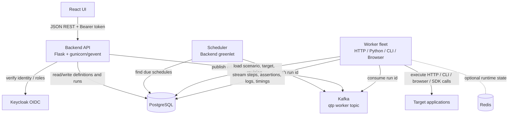
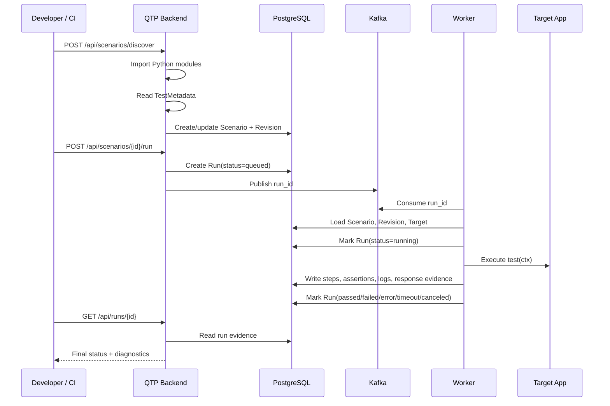

<div align="center">
  <h1>🎯 Quality Testing Platform (QTP)</h1>
  <p><b>A developer-first automation testing control plane and Python authoring framework for running, scheduling, observing, and analyzing tests against any target application.</b></p>

  
  
  
  
  
  
  
</div>

<br/>

QTP, short for **Quality Testing Platform**, centralizes automated verification for deployed systems. Instead of scattering checks across Postman collections, shell scripts, CI-only jobs, browser test runners, and ad-hoc cron jobs, QTP gives you one place to define, execute, schedule, inspect, triage, and trend your quality signal.

At its core, QTP combines:

1. **An execution control plane** — scenario definitions, revisions, schedules, targets, a durable Kafka-backed run queue, and horizontally scalable workers.
2. **A reporting and triage layer** — persistent run history, dashboards, step timelines, assertion evidence, deterministic failure signatures, and defect classification.
3. **A developer-native Python authoring framework** — scenarios are ordinary Python classes with first-class helpers for HTTP, CLI, browser, custom Python logic, variables, secrets, logging, cleanup, and evidence capture.
4. **A no-code Request Builder** — Postman-like HTTP workflow creation directly in the UI, saved as first-class QTP scenarios.

The result is a single platform where developers and testers can answer:

- What does “working” mean for this environment?
- Which checks are running, when, and against which target?
- What failed, exactly?
- Was it a product bug, automation bug, or infrastructure issue?
- Can this deployment be promoted safely?

---

## Table of Contents

- [What QTP Solves](#what-qtp-solves)
- [Key Capabilities](#key-capabilities)
- [Scope, Use Cases, and Non-Goals](#scope-use-cases-and-non-goals)
- [Architecture](#architecture)
- [Run Flow](#run-flow)
- [Quick Start with Docker](#quick-start-with-docker)
- [Accessing the Platform](#accessing-the-platform)
- [Getting an API Token](#getting-an-api-token)
- [Core Concepts](#core-concepts)
- [Scenario Lifecycle](#scenario-lifecycle)
- [Repository Layout and Discovery](#repository-layout-and-discovery)
- [Metadata Contract](#metadata-contract)
- [Targets and Environments](#targets-and-environments)
- [Authoring Scenarios](#authoring-scenarios)
  - [Scenario Types](#scenario-types)
  - [HTTP API Scenarios](#http-api-scenarios)
  - [Python Logic Scenarios](#python-logic-scenarios)
  - [Browser Scenarios](#browser-scenarios)
  - [CLI Scenarios](#cli-scenarios)
- [Assertions Reference](#assertions-reference)
- [Variables, Templating, Secrets, and Auth](#variables-templating-secrets-and-auth)
- [Steps, Logging, and Evidence](#steps-logging-and-evidence)
- [Request Builder](#request-builder)
- [Scheduling](#scheduling)
- [Execution and Results](#execution-and-results)
- [Defect Triage and Failure Analysis](#defect-triage-and-failure-analysis)
- [CI/CD Integration](#cicd-integration)
- [REST API Reference](#rest-api-reference)
- [Ports](#ports)
- [Local Development](#local-development)
- [Patterns and Best Practices](#patterns-and-best-practices)
- [Extending QTP](#extending-qtp)
- [Troubleshooting](#troubleshooting)

---

## What QTP Solves

As systems grow, verification tends to fragment:

- API checks live in Postman or Newman.
- Browser tests live in a separate CI job.
- Smoke checks are implemented as Bash scripts.
- Synthetic monitoring is configured elsewhere.
- Run results are buried in CI logs.
- Failure triage happens manually in Slack, Jira, or comments.

That fragmentation makes failures expensive. When a deployment breaks, engineers often need to reconstruct the event from multiple tools: CI output, service logs, screenshots, traces, browser console errors, HTTP payloads, and test runner output.

**QTP consolidates this into a single testing control plane.** You write scenarios as Python code in your repository, or build them visually through the Request Builder. QTP discovers them, executes them through workers, stores rich evidence for every run, and exposes dashboards and APIs for humans and CI/CD systems.

---

## Key Capabilities

- **Python-first scenario authoring** — write tests as normal Python classes, not opaque YAML or brittle DSLs.
- **Multiple execution modes** — HTTP, Python, CLI, Playwright, and Selenium scenarios.
- **Environment-agnostic targets** — scenarios reference a stable target key instead of hard-coding URLs.
- **Code discovery** — QTP imports scenario classes from `backend/scenarios/automation/` and registers/revises them.
- **No-code Request Builder** — create multi-step HTTP workflows directly in the UI.
- **Durable asynchronous execution** — backend queues runs, workers consume them, and run state is stored in PostgreSQL.
- **Kafka-backed worker dispatch** — decouples run requests from execution capacity.
- **Schedules** — interval and cron-based automated runs for smoke, regression, and production monitoring.
- **Rich evidence** — assertions, expected-vs-actual values, request/response payloads, headers, timings, logs, and steps.
- **Waterfall diagnostics** — network timeline for HTTP/browser activity, including DNS, TTFB, content download, duplicate request detection, interaction delays, and visibility changes.
- **Defect triage** — classify failed runs as `product_bug`, `automation_bug`, `system_issue`, `to_investigate`, or `no_defect`.
- **Dashboards** — overview metrics, pass/fail trends, failure signatures, defect split, and run history.
- **CI/CD native API** — trigger, poll, and gate deployments through REST.
- **Worker capabilities** — workers advertise what they can run: `http`, `python`, `cli`, `playwright`, `selenium`.

---

## Scope, Use Cases, and Non-Goals

QTP is designed for **black-box, environment-facing verification**: tests that interact with deployed software through real interfaces.

### Good fits

| Use case | Why QTP fits |
| --- | --- |
| Production smoke checks | Schedule lightweight checks against production every few minutes. |
| Deployment gates | CI triggers QTP after deployment and fails the pipeline if checks fail. |
| API contract checks | Assert status, headers, payload shape, and critical fields. |
| Multi-service workflows | Create data through one service, verify it through another, then clean up. |
| Browser smoke tests | Use Playwright/Selenium for login, checkout, dashboards, and UI regressions. |
| Synthetic monitoring | Run critical flows continuously and inspect rich evidence when they fail. |
| Environment promotion | Run the same scenario suite against staging, preview, and production by changing the Target. |
| Reliability triage | Separate product defects from flaky automation and infrastructure issues. |

### Non-goals

QTP is **not** intended to replace:

- **Unit test runners** such as `pytest`, JUnit, or Jest. Keep fast in-process tests in the application repository.
- **Dedicated load-testing tools** such as k6, Gatling, Locust, or JMeter. QTP can invoke those through `CliTest`, but it is not a sustained high-RPS engine itself.
- **Full observability platforms** such as Prometheus, Grafana, Jaeger, or OpenTelemetry. QTP complements them with test-centric evidence.

---

## Architecture

QTP is a modulith-style platform with independently scalable entrypoints:

- **Backend API + UI control plane** — owns targets, scenarios, revisions, runs, schedules, dashboards, and REST endpoints.
- **Scheduler** — runs inside the backend as a lightweight greenlet, guarded by a PostgreSQL advisory lock so only one active scheduler enqueues due work across replicas.
- **Kafka queue** — run dispatch topic used to decouple user/API requests from worker execution.
- **Workers** — horizontally scalable execution processes that consume run IDs, resolve targets, execute scenarios, and stream evidence to PostgreSQL.
- **PostgreSQL** — system of record for targets, scenarios, revisions, schedules, runs, steps, assertions, logs, and diagnostics.
- **Redis** — required by the QF ETL worker runtime that backs the Kafka consumer (coordination/state); also available for caching where configured.
- **Keycloak** — OIDC identity provider for user authentication and role-based access.
- **React frontend** — developer UI for authoring, running, inspecting, scheduling, and triaging scenarios.



---

## Run Flow

A typical code-backed scenario goes through this path:



Runs are asynchronous by default. The backend records the run immediately as `queued`, then a compatible worker claims it later. This design makes QTP resilient under load and allows multiple worker types to scale independently.

---

## Quick Start with Docker

### Prerequisites

- Docker
- Docker Compose
- `curl` and `jq` for API examples

### Start the stack

```bash
docker compose up -d --build
```

This launches a local QTP stack with:

- PostgreSQL 17
- Kafka
- Redis
- Jaeger
- Keycloak 26.1 with imported realm
- Demo target service
- Backend API and scheduler
- Execution workers
- React frontend SPA

### Check containers

```bash
docker compose ps
```

### Tail logs

```bash
# Backend logs
docker compose logs -f backend

# Worker logs
docker compose logs -f worker

# Frontend logs
docker compose logs -f frontend
```

### Stop the stack

```bash
docker compose down
```

To remove local volumes as well:

```bash
docker compose down -v
```

---

## Accessing the Platform

| Service | URL | Default credentials |
| --- | --- | --- |
| Web UI | http://localhost:5173 | `admin` / `admin` |
| Backend API | http://localhost:5100/qtp | Bearer token |
| Keycloak Admin | http://localhost:8080 | `admin` / `admin` |
| Kafka UI | http://localhost:8081 | — |
| Jaeger UI | http://localhost:16686 | — |

> The default `admin` / `admin` credentials are for local development only. Change them before any shared, staging, or production deployment.

---

## Getting an API Token

For local development and CI examples, the stack supports a system bearer token:

```bash
curl -s http://localhost:5100/qtp/api/scenarios \
  -H "Authorization: Bearer system-bearer-token" | jq
```

For real environments, use an OIDC-issued token from Keycloak or your configured identity provider.

---

## Core Concepts

| Entity | Meaning | Important fields |
| --- | --- | --- |
| **Target** | The system under test. It hides concrete environment details behind a stable key. | `key`, `base_url`, `default_headers`, `environment`, `tags` |
| **Scenario** | The logical definition of what is verified. One Python class or one Request Builder config. | `key`, `name`, `type`, `target`, `tags`, `owner` |
| **Revision** | Immutable snapshot of a scenario definition/config. Discovery creates a new revision when a scenario changes. | revision number, config, created time |
| **Run** | One execution of one scenario revision. Produces evidence and finishes in a terminal state. | `status`, `steps`, `assertions`, `duration`, `defect_type` |
| **Schedule** | Rule that triggers runs automatically on an interval or cron. | recurrence, target, scenarios, next fire time |

Relationship model:

```text
Target (staging_api)
  └── Scenario (login_flow)
       ├── Revision v1
       │    └── Run #104   passed
       └── Revision v2
            ├── Run #105   failed   -> triaged: automation_bug
            └── Run #106   passed
```

Because each run is pinned to a revision, historical results stay honest. A run from last week is tied to the scenario definition that existed last week, even if the Python file changed later.

---

## Scenario Lifecycle

Every scenario follows the same lifecycle hooks:

```text
validate_config -> setup -> test -> cleanup -> teardown
                       |       |          |          |
                       |       |          |          └─ release sessions, browsers, drivers
                       |       |          └─ undo side effects; runs on success and failure
                       |       └─ assertions and scenario behavior
                       └─ prepare fixtures, auth, test data
```

| Hook | When it runs | Typical use |
| --- | --- | --- |
| `validate_config` | During discovery | Reject invalid metadata or default config before runtime. |
| `setup(ctx)` | Before `test` | Authenticate, seed fixtures, initialize clients. |
| `test(ctx)` | Main execution | Drive the system and record assertions. Required. |
| `cleanup(ctx)` | After `test`, even after failure | Delete resources created by the scenario. |
| `teardown(ctx)` | Last, even after failure | Close sessions, browsers, drivers, files, etc. |

Assertions are fail-fast: the first failed assertion stops `test(ctx)` and marks the run as `failed`. An unexpected exception marks the run as `error`, which helps distinguish product behavior from test/infra problems.

`cleanup(ctx)` and `teardown(ctx)` still run when the test fails or errors. Cleanup failures are surfaced separately in run detail so leaked resources are visible without hiding the original failure.

---

## Repository Layout and Discovery

Code-backed scenarios live under:

```text
backend/scenarios/automation/
```

Recommended structure:

```text
backend/scenarios/automation/
├── example_api/
│   ├── fetch_user.py          -> scenarios.automation.example_api.fetch_user
│   └── create_post.py
├── payments/
│   ├── checkout_e2e.py
│   └── _helpers.py            -> helper module, not discovered
└── qtp_self/
    ├── health.py
    └── targets_crud.py
```

Discovery rules:

- Every `.py` file under `backend/scenarios/automation/` is imported recursively.
- Files named `__init__.py` are skipped.
- Files starting with `_`, such as `_helpers.py`, are skipped and can be used for shared helper code.
- A class is registered only if it subclasses a QTP base class and declares `metadata`.
- `metadata.key` must be globally unique.
- Duplicate keys fail discovery loudly instead of silently overwriting a scenario.
- Discovery validates scenario config up front so invalid definitions fail before runtime.

Run discovery from the UI or API:

```bash
curl -sf -X POST http://localhost:5100/qtp/api/scenarios/discover \
  -H "Authorization: Bearer system-bearer-token" | jq
```

---

## Metadata Contract

Every code-backed scenario declares a `TestMetadata` object.

| Field | Required | Purpose |
| --- | --- | --- |
| `key` | Yes | Globally unique scenario ID used by UI/API/CI. Prefer dotted names, e.g. `checkout.success`. |
| `name` | Yes | Human-readable scenario name shown in the UI. |
| `type` | Yes | Scenario type: `TYPE_HTTP`, `TYPE_PYTHON`, `TYPE_CLI`, `TYPE_PLAYWRIGHT`, or `TYPE_SELENIUM`. |
| `target` | Usually | Target key used to resolve `base_url` and default headers. Defaults to `default` where supported. |
| `tags` | No | Free-form labels for filtering, scheduling, and dashboards. |
| `owner` | No | Owning user/team shown in the UI and audit trail. |
| `default_config` | No | Adapter defaults such as method, URL, timeout, headers, or assertions. |

Example:

```python
from src.testkit import HttpTest, TestMetadata, TYPE_HTTP


class FetchUser(HttpTest):
    metadata = TestMetadata(
        key="example.fetch_user",
        name="Fetch User Flow",
        type=TYPE_HTTP,
        target="example_api",
        tags=["example", "smoke"],
        owner="platform-team",
    )

    def test(self, ctx):
        resp = ctx.http.get("/users/1")
        resp.should.have_status(200)
```

---

## Targets and Environments

Targets make scenarios environment-agnostic. A scenario references a target key, and QTP resolves that key at runtime to a concrete base URL and default headers.

Example target:

```json
{
  "key": "payments_service",
  "name": "Payments API (Staging)",
  "base_url": "https://payments.staging.internal",
  "environment": "staging",
  "default_headers": {
    "X-Client-Id": "qtp-automation"
  },
  "tags": ["api", "payments"]
}
```

Using a target in code:

```python
# target="payments_service" resolves the base URL for this request.
ctx.http.get("/v1/charges")

# Absolute URLs are used as-is.
ctx.http.get("https://other-service.example.com/health")
```

Two common target strategies:

1. **One target per service, CI rewrites the base URL** before running a suite.
2. **One target per environment**, such as `users_api_staging`, `users_api_preview`, and `users_api_prod`.

In both strategies, scenario code should not change when environments change.

---

## Authoring Scenarios

QTP scenarios are Python classes. The class declares metadata and implements `test(ctx)`. Hooks such as `setup`, `cleanup`, and `teardown` are optional.

### Scenario Types

| Base class | Main context API | Best for | Notes |
| --- | --- | --- | --- |
| `HttpTest` | `ctx.http` | REST, GraphQL, HTTP services | Best default for API checks; captures request/response evidence automatically. |
| `PythonTest` | Any Python | DBs, queues, SDKs, custom business logic | Import libraries and record explicit assertions with `ctx.assert_that`. |
| `CliTest` | `ctx.cli` | Shell commands, CLIs, wrappers around existing tools | Captures exit code, stdout, stderr, and duration. |
| `PlaywrightTest` | `ctx.browser` | Modern browser workflows | Managed Chromium session with network, console, page-error capture. |
| `SeleniumTest` | WebDriver | Legacy browser suites or Selenium Grid | Drive WebDriver directly and record assertions manually. |

---

### HTTP API Scenarios

`HttpTest` is optimized for REST and GraphQL. It provides:

- `ctx.http.get/post/put/patch/delete/head`
- Fluent response assertions
- JSON field assertions
- Header assertions
- Response-time assertions
- Automatic request/response evidence
- Waterfall timing entries

#### Single-step check

```python
from src.testkit import HttpTest, TestMetadata, TYPE_HTTP


class HealthOk(HttpTest):
    metadata = TestMetadata(
        key="self.health",
        name="Service · health returns ok",
        type=TYPE_HTTP,
        target="qtp_self",
        tags=["smoke"],
    )

    def test(self, ctx):
        resp = ctx.http.get("/health")

        resp.should.have_status(200)
        resp.should.respond_within_ms(3000)
        resp.json.should.have_field("status").equal_to("ok")
        resp.json.should.have_field("service").equal_to("qtp")
```

#### Stateful multi-step workflow

```python
from src.testkit import HttpTest, TestMetadata, TYPE_HTTP

TOKEN = {"type": "bearer", "token": "{{api_token}}"}


class TargetsCrud(HttpTest):
    metadata = TestMetadata(
        key="self.targets_crud",
        name="Targets · create → read → delete",
        type=TYPE_HTTP,
        target="qtp_self",
        tags=["api", "multi-step"],
    )

    def test(self, ctx):
        with ctx.step("Create target"):
            resp = ctx.http.post("/api/targets", auth=TOKEN, json={
                "key": "scn_tgt",
                "name": "Scenario Target",
                "base_url": "http://example.com",
            })
            resp.should.have_status(201)
            ctx.set_var("target_id", resp.json.get("$.id"))

        with ctx.step("Read target"):
            target_id = ctx.get_var("target_id")
            resp = ctx.http.get(f"/api/targets/{target_id}", auth=TOKEN)
            resp.should.have_status(200)
            resp.json.should.have_field("target.key").equal_to("scn_tgt")

    def cleanup(self, ctx):
        target_id = ctx.get_var("target_id")
        if target_id:
            ctx.http.delete(f"/api/targets/{target_id}", auth=TOKEN)
            ctx.log("info", "deleted scenario target", target_id=target_id)
```

#### HTTP client arguments

| Argument | Type | Meaning |
| --- | --- | --- |
| `json=` | `dict` / `list` | JSON body; sets `Content-Type: application/json`. |
| `data=` | `dict` / `bytes` | Form-encoded body or raw bytes. |
| `text=` | `str` | Plain text body with template expansion. |
| `headers=` | `dict` | Per-request headers merged over target defaults. |
| `params=` | `dict` | Query string parameters. |
| `auth=` | `dict` | Bearer, API key, or basic auth helper. |
| `timeout_ms=` | `int` | Per-request timeout override. |
| `follow_redirects=` | `bool` | Follow 3xx redirects and record each hop. |

---

### Python Logic Scenarios

Use `PythonTest` when the check needs arbitrary Python: database queries, Kafka publishes, SDK calls, file validation, complex business logic, or cross-system assertions.

```python
from src.testkit import PythonTest, TestMetadata, TYPE_PYTHON
import requests


class ExampleDomainCheck(PythonTest):
    metadata = TestMetadata(
        key="misc.example_domain",
        name="example.com serves the marketing page",
        type=TYPE_PYTHON,
        target="qtp_self",
        tags=["python", "http"],
    )

    def test(self, ctx):
        ctx.log("info", "requesting example.com")
        resp = requests.get("https://example.com/", timeout=10)

        ctx.assert_that(
            "status_code",
            "equals",
            resp.status_code,
            200,
            resp.status_code == 200,
            message="expected HTTP 200",
        )

        ctx.assert_that(
            "body",
            "contains",
            resp.text,
            "Example Domain",
            "Example Domain" in resp.text,
            message="marketing copy present",
        )
```

`ctx.assert_that(...)` stores an assertion in QTP evidence with expected value, actual value, operator, pass/fail result, and message.

---

### Browser Scenarios

Use `PlaywrightTest` for modern browser workflows. `ctx.browser` manages Chromium and captures:

- network requests
- console messages
- page errors
- waterfall timings
- duplicate request patterns
- long interaction delays
- page visibility changes

```python
from src.testkit import PlaywrightTest, TestMetadata, TYPE_PLAYWRIGHT


class HomepageLoads(PlaywrightTest):
    metadata = TestMetadata(
        key="web.homepage",
        name="Homepage renders the hero",
        type=TYPE_PLAYWRIGHT,
        target="marketing_site",
        tags=["ui", "smoke"],
    )

    def test(self, ctx):
        result = ctx.browser.visit("/")

        result.should.have_status(200)
        result.should.have_title_containing("Acme")
        result.should.have_visible("h1")
        result.should.show_text("Get started")

        # Drop into raw Playwright when needed.
        page = result.page
        page.click("text=Get started")
        page.wait_for_url("**/signup")
```

For legacy suites or Selenium Grid:

```python
from src.testkit import SeleniumTest, TestMetadata, TYPE_SELENIUM


class LegacyLogin(SeleniumTest):
    metadata = TestMetadata(
        key="web.legacy_login",
        name="Legacy login via WebDriver",
        type=TYPE_SELENIUM,
        target="legacy_portal",
    )

    def test(self, ctx):
        from selenium import webdriver
        from selenium.webdriver.common.by import By

        options = webdriver.ChromeOptions()
        options.add_argument("--headless=new")
        options.add_argument("--no-sandbox")
        driver = webdriver.Chrome(options=options)

        try:
            driver.get("https://legacy.example.com/login")
            title = driver.find_element(By.TAG_NAME, "h1").text.strip()
            ctx.assert_that(
                "title",
                "equals",
                title,
                "Sign in",
                title == "Sign in",
                message="login page shown",
            )
        finally:
            driver.quit()
```

---

### CLI Scenarios

Use `CliTest` to wrap command-line tooling such as `curl`, `newman`, `k6`, custom binaries, or infrastructure scripts.

```python
from src.testkit import CliTest, TestMetadata, TYPE_CLI


class DogFactsReachable(CliTest):
    metadata = TestMetadata(
        key="cli.dog_facts",
        name="Dog facts API responds",
        type=TYPE_CLI,
        target="qtp_self",
        tags=["cli"],
    )

    def test(self, ctx):
        res = ctx.cli.run("curl -s -o /dev/null -w '%{http_code}' https://dogapi.dog/api/v2/facts")

        res.should.succeed()
        res.should.output_contains("200")
        res.should.complete_within_ms(5000)
```

Useful `ctx.cli.run` options:

| Option | Meaning |
| --- | --- |
| `cwd=` | Working directory. |
| `env=` | Extra environment variables. |
| `input_text=` | Standard input passed to the command. |
| `timeout_s=` | Command timeout in seconds. |

Fluent CLI assertions include:

- `succeed()`
- `fail()`
- `have_exit_code(n)`
- `output_contains(text)`
- `output_matches(regex)`
- `stderr_contains(text)`
- `complete_within_ms(ms)`

---

## Assertions Reference

Assertions are persisted evidence. QTP stores what was expected, what actually happened, whether it passed, and where it happened in the step timeline.

### Response assertions

```python
resp.should.have_status(200)
resp.should.have_status_in([200, 201, 204])
resp.should.respond_within_ms(3000)
resp.should.contain_text("success")
resp.should.not_contain_text("error")
resp.should.match_regex(r"order-[0-9]+")
```

### Header assertions

```python
resp.should.have_header("content-type").that_exists()
resp.should.have_header("content-type").containing("application/json")
resp.should.have_header("x-request-id").matching(r"^[a-f0-9-]+$")
```

### JSON assertions

Paths can be dotted, bracket-based, or JSONPath-style:

```python
resp.json.should.have_field("user.email").exists()
resp.json.should.have_field("items[0].id").exists()
resp.json.should.have_field("$.data.token").exists()
```

Supported field assertions:

```python
resp.json.should.have_field("id").equal_to(1)
resp.json.should.have_field("status").not_equal_to("deleted")
resp.json.should.have_field("name").containing("Bogdan")
resp.json.should.have_field("email").matching(r".+@.+")
resp.json.should.have_field("role").one_of(["admin", "operator"])
resp.json.should.have_field("total").greater_than(0)
resp.json.should.have_field("total").at_least(0)
resp.json.should.have_field("items").with_length_at_least(1)
```

Shape checks:

```python
resp.json.should.be_an_array()
resp.json.should.be_an_object()
```

Extracting values:

```python
user_id = resp.json.get("$.id")
ctx.set_var("user_id", user_id)
```

### Operator taxonomy

These operators are shared by code scenarios, `ctx.assert_that`, and Request Builder assertions.

| Operator | Applies to | Semantics |
| --- | --- | --- |
| `equals` / `not_equals` | any | Exact match, compared as value and string where useful. |
| `contains` / `not_contains` | string | Substring presence. |
| `matches` / `not_matches` | regex | Python regex search against actual value. |
| `gt` / `gte` / `lt` / `lte` | number | Numeric comparison after float coercion. |
| `length_eq` / `length_gte` / `length_lte` | collection | Compares `len(actual)` against expected number. |
| `in` / `not_in` | list | Membership check. |
| `exists` / `not_exists` | field/path/header | Presence check. |

---

## Variables, Templating, Secrets, and Auth

QTP supports `{{variable}}` templating inside URLs, headers, query params, and text bodies.

Resolution order:

1. Run variables set through `ctx.set_var` or captures.
2. Secrets configured for the run/environment.

Example:

```python
def test(self, ctx):
    login = ctx.http.post("/auth/login", json={"user": "alice"})
    ctx.set_var("token", login.json.get("$.access_token"))

    me = ctx.http.get("/me", headers={"Authorization": "Bearer {{token}}"})
    me.should.have_status(200)
```

### Auth helpers

`auth=` supports Bearer, API key, and Basic auth.

```python
# Bearer token from a template variable
ctx.http.get("/me", auth={"type": "bearer", "token": "{{api_token}}"})

# Bearer token from a secret reference
ctx.http.get("/me", auth={"type": "bearer", "tokenSecretRef": "PROD_TOKEN"})

# API key header
ctx.http.get("/data", auth={
    "type": "apikey",
    "headerName": "X-API-Key",
    "value": "{{key}}",
})

# HTTP Basic
ctx.http.get("/admin", auth={
    "type": "basic",
    "username": "svc",
    "password": "{{pw}}",
})
```

Secrets are redacted before logs and artifacts are persisted. Prefer secret references over hard-coded credentials in scenario files.

---

## Steps, Logging, and Evidence

Three APIs shape the run detail page:

| API | Use |
| --- | --- |
| `ctx.step("name")` | Groups actions into a named, timed phase. Failures inside the block mark that step failed. |
| `ctx.log(level, message, **context)` | Writes structured logs to the run. Supports levels such as `debug`, `info`, `warning`, and `error`. |
| `ctx.assert_that(...)` | Records explicit assertion evidence for custom Python logic. |

Example:

```python
def test(self, ctx):
    with ctx.step("Warm up"):
        ctx.log("info", "priming cache")
        ctx.http.get("/health").should.have_status(200)

    with ctx.step("Place order"):
        resp = ctx.http.post("/orders", json={"sku": "A1", "qty": 2})
        resp.should.have_status(201)
        ctx.log("info", "order created", order_id=resp.json.get("$.id"))
```

Run detail can include:

- assertion table with expected vs actual
- response headers and body
- request payloads
- structured logs
- step timeline
- waterfall chart
- browser console messages
- page errors
- network events
- duplicate request detection
- cleanup result
- defect classification

---

## Request Builder

The Request Builder is a no-code, Postman-style editor for multi-step HTTP workflows.

Builder scenarios support:

- target selection
- ordered HTTP steps
- methods, URLs, headers, params, and bodies
- authentication helpers
- assertions
- captures from JSON path/header/body
- `{{variable}}` templating between steps
- ad-hoc execution without saving
- saving as first-class QTP scenarios
- scheduling and CI execution like code scenarios

Example builder payload:

```json
{
  "name": "Auth and fetch profile",
  "config": {
    "target": "users_api",
    "steps": [
      {
        "id": "login",
        "method": "POST",
        "url": "/api/login",
        "body": {
          "mode": "json",
          "raw": "{\"user\":\"alice\"}"
        },
        "captures": [
          {
            "name": "token",
            "source": "json_path",
            "path": "$.token"
          }
        ],
        "assertions": [
          {
            "type": "status_code",
            "operator": "equals",
            "expected": 200
          }
        ]
      },
      {
        "id": "profile",
        "method": "GET",
        "url": "/api/me",
        "headers": [
          {
            "name": "Authorization",
            "value": "Bearer {{token}}"
          }
        ],
        "assertions": [
          {
            "type": "json_path",
            "path": "$.role",
            "operator": "equals",
            "expected": "admin"
          }
        ]
      }
    ]
  }
}
```

Try a config without saving:

```bash
curl -sf -X POST http://localhost:5100/qtp/api/request-tests/send \
  -H "Authorization: Bearer system-bearer-token" \
  -H "Content-Type: application/json" \
  -d @request-test.json | jq
```

Persist a builder scenario:

```bash
curl -sf -X POST http://localhost:5100/qtp/api/request-tests \
  -H "Authorization: Bearer system-bearer-token" \
  -H "Content-Type: application/json" \
  -d @request-test.json | jq
```

---

## Scheduling

Schedules fire one or more scenarios automatically and roll their individual runs into an aggregate schedule result.

| Pattern | Cadence | Good for |
| --- | --- | --- |
| Continuous monitoring | Every 1–5 minutes | Critical P0 flows in production. |
| Post-deploy gate | On demand from CI | Regression suite after deploy. |
| Nightly regression | `0 2 * * *` | Long E2E suites. |
| Hourly canary | Every hour | Broad cheap coverage between deploys. |

Recommended tagging strategy:

| Tag | Meaning |
| --- | --- |
| `smoke` | Very small set of core checks. |
| `p0` | Business-critical checks. |
| `p1` | Important but less critical checks. |
| `regression` | Larger suite for full validation. |
| `nightly` | Expensive/long-running checks. |
| `api` / `ui` / `cli` | Execution surface. |
| service tag, e.g. `payments` | Owning service/domain. |

---

## Execution and Results

Run statuses:

| Status | Kind | Meaning |
| --- | --- | --- |
| `queued` | Active | Run requested and waiting for a worker. |
| `running` | Active | Worker claimed the run and is executing `test(ctx)`. |
| `passed` | Terminal | All assertions passed. |
| `failed` | Terminal | An assertion failed. Usually product behavior is wrong. |
| `error` | Terminal | Scenario raised unexpectedly. Usually automation, environment, or infra issue. |
| `timeout` | Terminal | Scenario exceeded its time budget. |
| `canceled` | Terminal | Cancellation was requested before completion. |

Why `failed` vs `error` matters:

- `failed` means the system under test violated an assertion.
- `error` means the scenario itself crashed, could not reach a dependency, used a bad selector, referenced missing data, etc.

Keeping them separate makes pass-rate and reliability metrics meaningful.

Useful operations:

- Re-run a scenario.
- Re-run a past run from the same revision.
- Cancel an active run.
- Bulk re-queue stuck queued runs.
- Bulk restart failed/errored runs.
- Delete old or irrelevant runs.
- Inspect cleanup status independently of verdict.

---

## Defect Triage and Failure Analysis

Failed or errored runs can be classified so dashboards distinguish application quality from automation quality.

| Defect type | Use when |
| --- | --- |
| `product_bug` | The application is genuinely wrong. File/fix a real defect. |
| `automation_bug` | The scenario is wrong: bad assertion, brittle selector, poor timing, invalid setup. |
| `system_issue` | Infrastructure or environment problem: flaky network, down dependency, bad deploy, capacity issue. |
| `to_investigate` | Failure is not yet classified. |
| `no_defect` | Known or expected failure that is not actionable. |

QTP groups recurring failures by signature, so one flaky root cause appears as one grouped failure with an occurrence count instead of dozens of unrelated red rows.

---

## CI/CD Integration

Your CI pipeline should not execute the tests directly. It should:

1. Deploy the application.
2. Ask QTP to discover scenario changes.
3. Trigger the right scenario or suite.
4. Poll until the run reaches a terminal state.
5. Fail the pipeline unless the result is `passed`.

### Discover on push or deploy

```bash
curl -sf -X POST "$QTP_URL/api/scenarios/discover" \
  -H "Authorization: Bearer $QTP_TOKEN"
```

### Trigger one scenario and poll

```bash
RUN_ID=$(curl -sf -X POST "$QTP_URL/api/scenarios/$SCENARIO_ID/run" \
  -H "Authorization: Bearer $QTP_TOKEN" \
  -H "Content-Type: application/json" \
  -d '{"tags": ["ci"]}' | jq -r '.id')

STATUS="queued"
while [ "$STATUS" = "queued" ] || [ "$STATUS" = "running" ]; do
  sleep 5
  STATUS=$(curl -sf "$QTP_URL/api/runs/$RUN_ID" \
    -H "Authorization: Bearer $QTP_TOKEN" | jq -r '.status')
done

[ "$STATUS" = "passed" ] || exit 1
```

### Run all scenarios for a target synchronously

```bash
curl -sf -X POST "$QTP_URL/api/targets/$TARGET_ID/run-all?sync=true" \
  -H "Authorization: Bearer $QTP_TOKEN" | jq
```

### GitHub Actions

```yaml
name: QTP E2E Tests

on: [deployment_status]

jobs:
  qtp:
    if: github.event.deployment_status.state == 'success'
    runs-on: ubuntu-latest
    steps:
      - name: Trigger and poll QTP scenario
        env:
          QTP_URL: ${{ secrets.QTP_URL }}
          QTP_TOKEN: ${{ secrets.QTP_TOKEN }}
          SCENARIO_ID: checkout.e2e
        run: |
          sudo apt-get update && sudo apt-get install -y jq

          curl -sf -X POST "$QTP_URL/api/scenarios/discover" \
            -H "Authorization: Bearer $QTP_TOKEN"

          RUN_ID=$(curl -sf -X POST "$QTP_URL/api/scenarios/$SCENARIO_ID/run" \
            -H "Authorization: Bearer $QTP_TOKEN" \
            -H "Content-Type: application/json" \
            -d '{"tags": ["github-actions"]}' | jq -r '.id')

          echo "QTP run: $RUN_ID"

          STATUS="queued"
          while [ "$STATUS" = "queued" ] || [ "$STATUS" = "running" ]; do
            sleep 5
            STATUS=$(curl -sf "$QTP_URL/api/runs/$RUN_ID" \
              -H "Authorization: Bearer $QTP_TOKEN" | jq -r '.status')
            echo "status=$STATUS"
          done

          [ "$STATUS" = "passed" ] || exit 1
```

### GitLab CI

```yaml
qtp_e2e:
  stage: test
  image: alpine:latest
  before_script:
    - apk add --no-cache curl jq
  variables:
    SCENARIO_ID: checkout.e2e
  script:
    - |
      curl -sf -X POST "$QTP_URL/api/scenarios/discover" \
        -H "Authorization: Bearer $QTP_TOKEN"

      RUN_ID=$(curl -sf -X POST "$QTP_URL/api/scenarios/$SCENARIO_ID/run" \
        -H "Authorization: Bearer $QTP_TOKEN" \
        -H "Content-Type: application/json" \
        -d '{"tags": ["gitlab-ci"]}' | jq -r '.id')

      STATUS="queued"
      while [ "$STATUS" = "queued" ] || [ "$STATUS" = "running" ]; do
        sleep 5
        STATUS=$(curl -sf "$QTP_URL/api/runs/$RUN_ID" \
          -H "Authorization: Bearer $QTP_TOKEN" | jq -r '.status')
      done

      [ "$STATUS" = "passed" ] || exit 1
```

---

## REST API Reference

Base URL for the bundled stack:

```text
http://localhost:5100/qtp/api
```

Authenticate with:

```text
Authorization: Bearer <token>
```

List endpoints typically support pagination, sorting, and filtering parameters such as `page`, `page_size`, `sort`, `order`, and field-level filters.

### Identity

| Method | Endpoint | Use |
| --- | --- | --- |
| `GET` | `/api/me` | Current developer identity, roles, and permissions. |
| `GET` | `/api/projects` | List projects (workspaces) visible to the caller. |

### Targets

| Method | Endpoint | Use |
| --- | --- | --- |
| `GET` | `/api/targets` | List registered applications under test. |
| `POST` | `/api/targets` | Register a target for a service or environment. |
| `GET` | `/api/targets/{id}` | Read one target and its configuration. |
| `PATCH` | `/api/targets/{id}` | Update a target base URL, headers, or tags. |
| `DELETE` | `/api/targets/{id}` | Delete a target. |
| `GET` | `/api/targets/{id}/tests` | List scenarios that belong to a target. |
| `GET` | `/api/targets/{id}/runs` | List runs for a target. |
| `GET` | `/api/targets/{id}/stats` | Pass/fail ratios and trends for a target. |
| `POST` | `/api/targets/{id}/reset-stats` | Reset a target's cached statistics. |
| `POST` | `/api/targets/{id}/run-all` | Queue every scenario for a target. Add `?sync=true` to block. |

### Scenarios

| Method | Endpoint | Use |
| --- | --- | --- |
| `GET` | `/api/scenarios` | List scenario definitions. UI route: `/scenarios`. |
| `POST` | `/api/scenarios/discover` | Import code-backed scenarios from the repository. |
| `GET` | `/api/scenarios/{id}` | Read a scenario, its revisions, and recent runs. |
| `DELETE` | `/api/scenarios/{id}` | Delete a scenario. |
| `POST` | `/api/scenarios/{id}/run` | Queue one scenario immediately. |
| `PUT` | `/api/scenarios/{id}/tags` | Replace the tag set on a scenario. |
| `GET` | `/api/scenarios/{id}/comments` | List triage comments on a scenario. |
| `POST` | `/api/scenarios/{id}/comments` | Add a comment (with optional tags) to a scenario. |

### Request Builder

| Method | Endpoint | Use |
| --- | --- | --- |
| `POST` | `/api/request-tests/send` | Execute a Request Builder config ad hoc without saving. |
| `POST` | `/api/request-tests/generate-assertions` | AI-suggest assertions from a captured response. |
| `POST` | `/api/request-tests` | Persist a Request Builder scenario. |
| `PATCH` | `/api/request-tests/{id}` | Update a saved Request Builder scenario (new revision). |
| `DELETE` | `/api/request-tests/{id}` | Delete a saved Request Builder scenario. |

### Runs

| Method | Endpoint | Use |
| --- | --- | --- |
| `GET` | `/api/runs` | Search execution history with server-side filters, sorting, and pagination. |
| `DELETE` | `/api/runs` | Delete every run (destructive). |
| `GET` | `/api/runs/{id}` | Read steps, assertions, response, timings, and failure metadata. |
| `DELETE` | `/api/runs/{id}` | Permanently delete one run. |
| `GET` | `/api/runs/{id}/logs` | Stream structured log lines for a run. |
| `GET` | `/api/runs/{id}/comments` | List triage comments on a run. |
| `POST` | `/api/runs/{id}/comments` | Add a comment (with optional tags) to a run. |
| `POST` | `/api/runs/{id}/cancel` | Request cancellation of a queued or running execution. |
| `POST` | `/api/runs/{id}/restart` | Restart this run in place (re-queue the same run). |
| `POST` | `/api/runs/{id}/re-run` | Queue a fresh run from the same scenario revision. |
| `PUT` | `/api/runs/{id}/defect` | Classify a failure. |
| `POST` | `/api/runs/re-run-queued` | Re-dispatch every stuck queued run. |
| `POST` | `/api/runs/restart-failed` | Re-queue every failed or errored run. |

### Schedules

| Method | Endpoint | Use |
| --- | --- | --- |
| `GET` | `/api/schedules` | List schedules and next fire times. |
| `POST` | `/api/schedules` | Create a schedule for one or more scenarios. |
| `GET` | `/api/schedules/{id}` | Read a schedule, its scenarios, and recent aggregate runs. |
| `PATCH` | `/api/schedules/{id}` | Update a schedule (cadence, scenarios, enabled). |
| `DELETE` | `/api/schedules/{id}` | Delete a schedule. |

### Dashboards, audit, and platform state

| Method | Endpoint | Use |
| --- | --- | --- |
| `GET` | `/api/dashboards/overview` | Operational metrics over a time window. |
| `GET` | `/api/dashboards/failures` | Failure signatures, defect split, and recent failed runs. |
| `GET` | `/api/workers` | Live worker fleet, capabilities, current run, and heartbeat. |
| `GET` | `/api/tags` | All tags in use, for filters and schedules. |
| `GET` | `/api/audit` | Global audit event ledger (who did what, when). |
| `GET` | `/api/audit/{type}/{id}` | Audit trail for one entity (run, scenario, schedule, …). |

> Health/readiness probes live outside `/api`: `GET /qtp/health`, `GET /qtp/liveness`, `GET /qtp/readiness`.

---

## Ports

| Port | Service |
| --- | --- |
| `5173` | Frontend UI |
| `5100` | Backend API |
| `8080` | Keycloak |
| `8081` | Kafka UI |
| `16686` | Jaeger UI |
| `5432` | PostgreSQL |

---

## Local Development

Docker Compose is the recommended path for local development. If you need to run services manually, use the following baseline commands and adapt paths/env vars to your repo.

### Backend

```bash
cd backend
python3 -m venv .venv
source .venv/bin/activate
pip install dist/qf-1.0.5-py3-none-any.whl -r requirements.txt
python scripts/init_db.py
gunicorn -c gunicorn.conf.py wsgi:app
```

### Worker

```bash
cd worker
PYTHONPATH=../backend ../backend/.venv/bin/gunicorn -c gunicorn.conf.py wsgi:app
```

### Frontend

```bash
cd frontend
npm install
npm run dev
```

### Common local commands

```bash
# Rebuild everything
docker compose up -d --build

# Run discovery
curl -sf -X POST http://localhost:5100/qtp/api/scenarios/discover \
  -H "Authorization: Bearer system-bearer-token" | jq

# List scenarios
curl -sf http://localhost:5100/qtp/api/scenarios \
  -H "Authorization: Bearer system-bearer-token" | jq

# List runs
curl -sf http://localhost:5100/qtp/api/runs \
  -H "Authorization: Bearer system-bearer-token" | jq
```

---

## Patterns and Best Practices

- **One scenario, one behavior.** Small, focused scenarios localize failures better than giant end-to-end scripts.
- **Assert the payload, not just the status.** A `200` with the wrong body is still a bug.
- **Use targets instead of hard-coded URLs.** Scenario code should work across local, staging, preview, and production.
- **Use tags deliberately.** Tags power schedules, dashboards, filters, and suite selection.
- **Always clean up side effects.** If `test(ctx)` creates a resource, `cleanup(ctx)` should delete it.
- **Prefer deterministic data.** Avoid relying on mutable external state, test order, or wall-clock timing where possible.
- **Record meaningful logs.** `ctx.log` should explain the scenario's intent and key IDs, not dump secrets or noisy payloads.
- **Use variables for flow state.** `ctx.set_var` makes data visible to later steps and templates.
- **Use secrets for credentials.** Do not commit tokens, API keys, or passwords to scenario files.
- **Treat `error` as automation/platform debt.** A scenario crash should be fixed separately from product defects.
- **Triage failures.** Defect typing is what makes quality metrics meaningful over time.
- **Keep browser tests lean.** Use API tests for broad coverage and browser tests for critical user journeys.
- **Gate with the API.** CI should trigger QTP and poll results instead of duplicating test execution logic.

---

## Extending QTP

You can add new scenario types or reusable bases for custom protocols such as gRPC, AMQP, proprietary services, or domain-specific SDKs.

A typical extension path:

1. Define a new type constant, e.g. `TYPE_GRPC`.
2. Register it in supported scenario types and worker capabilities.
3. Create a base class, e.g. `GrpcTest`, that provides a typed client through the context.
4. Record evidence through `ctx.assert_that(...)` so diagnostics remain consistent.
5. Package required libraries in the worker image.
6. Ensure at least one worker advertises the new capability.

For simpler reuse, put shared helper functions in underscore-prefixed modules such as `_helpers.py`; discovery skips those files but scenarios can import from them normally.

---

## Troubleshooting

### Scenario does not appear after discovery

Check:

- The file is under `backend/scenarios/automation/`.
- The filename does not start with `_`.
- The class subclasses a QTP base class such as `HttpTest`, `PythonTest`, `CliTest`, `PlaywrightTest`, or `SeleniumTest`.
- The class declares `metadata`.
- `metadata.key` is globally unique.
- The module imports without syntax/import errors.
- The discovery response does not contain validation errors.

### Run is stuck in `queued`

Likely causes:

- No worker is alive.
- Worker heartbeats are stale.
- The scenario needs a capability no worker advertises, such as `playwright`.
- Kafka is unavailable or backed up.
- The run queue has more work than current workers can process.

Check the Workers page and backend/worker logs.

### Run is `error`, not `failed`

`failed` means an assertion failed. `error` means the scenario raised unexpectedly.

Common causes:

- Bad import.
- Missing dependency in the worker image.
- Wrong selector in a browser test.
- Missing variable/capture.
- Target unavailable from the worker network.
- Unhandled Python exception.

Open the run logs and stack trace first.

### HTTP requests time out

Check:

- Worker container can reach the target host.
- DNS resolves inside the worker.
- Internal or loopback ranges are allowed by platform SSRF/network policy.
- The target base URL is correct.
- The specific request needs a higher `timeout_ms`.

### Cleanup failed

Cleanup failures are tracked independently of the main verdict. Open the cleanup section in run detail and inspect logs. Common causes are already-deleted resources, missing IDs, permission issues, or target unavailability.

### Browser tests fail locally but not in CI, or vice versa

Check:

- Browser worker image includes Playwright/Selenium dependencies.
- Headless mode is enabled.
- Viewport assumptions are explicit.
- Selectors are stable and not timing-sensitive.
- Network calls required by the UI are reachable from the worker.

### CI pipeline hangs while polling

Make sure your polling loop handles all terminal states:

- `passed`
- `failed`
- `error`
- `timeout`
- `canceled`

Also add a maximum wait time in CI to avoid infinite loops if the QTP API is unreachable or a run cannot be scheduled.

---

## Suggested Next Steps

1. Start the stack with `docker compose up -d --build`.
2. Open the UI at http://localhost:5173.
3. Create or verify a Target.
4. Add a small `HttpTest` under `backend/scenarios/automation/<target>/`.
5. Run discovery.
6. Execute the scenario.
7. Inspect assertions, response evidence, logs, steps, and waterfall.
8. Add a schedule or CI gate once the scenario is stable.

