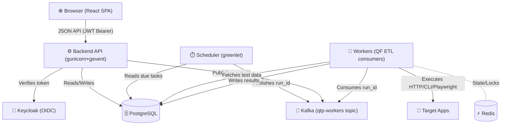

<div align="center">
  <h1>🎯 QSINT Testing Platform (QTP)</h1>
  <p><b>An automation testing control plane + framework for running, scheduling, observing, and analyzing automated tests against any target application.</b></p>
  
  
  
  
  
  
</div>

<br/>

As software systems grow, verifying behavior becomes scattered. API tests run in Postman, UI tests in a CI job with GitHub Actions, and integration tests as a bash script. When a pipeline fails, developers have to hunt down logs across different systems to figure out what broke.

**QTP solves this by providing a centralized testing control plane.** It acts as the single source of truth for both scenario execution and reporting. You can write your scenarios as standard Python code in a repository, and QTP will automatically discover them, run them on targeted environments, and provide a rich UI to inspect exactly what happened during the execution.

QTP combines two concepts that usually live in two separate tools:
1. **Testkube-style execution** — a control plane that owns test definitions, schedules, a durable PostgreSQL run queue, and horizontal workers that execute tests.
2. **ReportPortal-style reporting** — a centralized store of every run with history, dashboards, failure grouping (signatures), and defect-type triage.

---

## 📖 Table of Contents

- [🎯 Scope & Use Cases](#-scope--use-cases)
- [🧠 Core Concepts](#-core-concepts)
- [🏗 Architecture & Integration](#-architecture--integration)
- [🚀 Quick Start (Docker)](#-quick-start-docker)
- [🛠 Authoring Scenarios](#-authoring-scenarios)
  - [HTTP APIs](#1-http-apis)
  - [Python Custom Logic](#2-python-custom-logic)
  - [Browser Tests (Playwright/Selenium)](#3-browser-tests-playwrightselenium)
  - [CLI Tools](#4-cli-tools)
  - [Assertions & Captures](#5-assertions--captures)
  - [No-Code Request Builder](#6-no-code-request-builder)
- [⚙️ Operations & CI/CD](#️-operations--cicd)
- [🔌 API Reference & Ports](#-api-reference--ports)
- [💻 Local Development & Troubleshooting](#-local-development--troubleshooting)

---

## 🎯 Scope & Use Cases

QTP is highly versatile, supporting a wide range of validation strategies:

- **Continuous Delivery Gates:** Trigger regression suites automatically from Jenkins, GitLab CI, or GitHub Actions after a deployment.
- **Production Smoke & Sanity:** Schedule lightweight HTTP checks to run every 5 minutes against production APIs to ensure core flows (like login or checkout) are operational.
- **End-to-End Workflows:** Write complex, stateful scenarios that span multiple services (e.g., creating a user via API, modifying data via DB queries, and verifying it in the UI with Playwright).
- **Environment Promotion:** Run the exact same test suite against `staging` and `production` by simply swapping the Target definition.
- **Defect Triage:** When a test fails, triage it directly in the UI as a `product_bug`, `automation_bug`, or `system_issue` to measure test reliability vs actual application health.

---

## 🧠 Core Concepts

To effectively use QTP, you need to understand its five core entities:

- **Target:** The system you are testing. It defines a `base_url` (e.g., `https://api.staging.internal`). Targets abstract away environment details from your code.
- **Scenario (Test):** The logical definition of what you are verifying. It has a unique `key` (e.g., `checkout.success`), tags, and belongs to a Target.
- **Revision:** An immutable snapshot of a scenario's configuration at a specific point in time. When you change code and run discovery, a new revision is created.
- **Run:** A single execution attempt of a specific Revision. It produces evidence (steps, assertions, logs) and ends in a terminal state (`passed`, `failed`, `error`, `timeout`).
- **Schedule:** A rule to automatically trigger Runs (e.g., "Run all scenarios tagged 'smoke' against Target 'production_api' every 10 minutes").

---

## 🏗 Architecture & Integration

QTP is a **modulith with two entrypoints**: a **backend** (API + scheduler) and a **worker**, both scaling independently. Runs are dispatched to workers over **Kafka**.



**The Integration Flow:** You push a new Python scenario to your Git repo. A CI step calls QTP's `/discover` endpoint. QTP parses the new metadata. Later, a schedule or CI job calls `/run`. The backend queues a job. A Worker picks it up, pulls the latest code, executes the steps, and streams the assertions and logs back to the Control Plane in real-time.

---

## 🚀 Quick Start (Docker)

To build and start the entire stack locally:

```bash
docker compose up -d --build
```

This launches PostgreSQL 17, Kafka, Redis, Jaeger, Keycloak 26.1 (with auto-imported realm), a demo target (`httpbin`), the QTP backend API, 3 execution workers, and the frontend SPA.

### 🌐 Accessing the Platform

| Service | URL | Credentials |
| --- | --- | --- |
| **Web UI** | [http://localhost:5173](http://localhost:5173) | `admin` / `admin` |
| **Backend API** | [http://localhost:5100/qtp](http://localhost:5100/qtp) | Bearer token (Keycloak) |
| **Keycloak Admin** | [http://localhost:8080](http://localhost:8080) | `admin` / `admin` |
| **Kafka UI** | [http://localhost:8081](http://localhost:8081) | — |
| **Jaeger UI** | [http://localhost:16686](http://localhost:16686) | — |

> **Note:** The only pre-configured application user is `admin` / `admin` (Keycloak realm `qtp`, role `qtp_admin`). Be sure to change these credentials before any non-local use.

### 🔑 Getting an API Token

For curl/CI integration, you can use the hardcoded system token:
```bash
curl -s http://localhost:5100/qtp/api/tests -H "Authorization: Bearer system-bearer-token"
```

---

## 🛠 Authoring Scenarios

You can write tests in standard Python inside `backend/scenarios/automation/`. No registration is needed; QTP automatically discovers new files mapped to your target directories.

### 1. HTTP APIs
The `HttpTest` base class is optimized for REST and GraphQL APIs. It provides a fluent assertion syntax and automatically logs full request/response payloads as evidence.

```python
from src.testkit import TYPE_HTTP, HttpTest, TestMetadata

class CreateOrderTest(HttpTest):
    metadata = TestMetadata(
        key="orders.create",
        name="Create a new order",
        type=TYPE_HTTP,
        target="orders_api",
    )

    def test(self, ctx):
        # ctx.http automatically prefixes the Target's base_url
        response = ctx.http.post("/api/v1/orders", json={"item_id": 42})
        
        # Fluent assertions log directly to the Run evidence
        response.should.have_status(201)
        response.should.respond_within_ms(500)
        
        # JSON body assertions
        response.json.should.have_field("order_id").exists()
```

### 2. Python Custom Logic
Sometimes you need to do things outside of HTTP, like querying a database, publishing a Kafka message, or validating complex business logic. The `PythonTest` class gives you a blank canvas.

```python
from src.testkit import TYPE_PYTHON, PythonTest, TestMetadata
import psycopg2

class DatabaseReconciliationTest(PythonTest):
    metadata = TestMetadata(key="db.sync", name="Check DB sync state", type=TYPE_PYTHON, target="db_target")

    def test(self, ctx):
        conn = psycopg2.connect("postgresql://user:pass@db:5432/app")
        cursor = conn.cursor()
        cursor.execute("SELECT count(*) FROM async_jobs WHERE status = 'FAILED'")
        failed_count = cursor.fetchone()[0]
        
        # Explicitly record an assertion
        ctx.assert_true(failed_count < 10, f"Failed job queue too high: {failed_count}")
```

### 3. Browser Tests (Playwright/Selenium)
For UI smoke tests, QTP supports Playwright with a managed browser context.

```python
from src.testkit import TYPE_PLAYWRIGHT, PlaywrightTest, TestMetadata
from playwright.sync_api import expect

class LoginUiTest(PlaywrightTest):
    metadata = TestMetadata(key="ui.login", name="User Login Flow", type=TYPE_PLAYWRIGHT, target="webapp")

    def test(self, ctx):
        page = ctx.browser.page
        page.goto("/login")  # base_url is applied automatically
        
        page.fill("input[name='username']", "testuser")
        page.fill("input[name='password']", "secure123")
        page.click("button[type='submit']")
        
        # Playwright assertions are captured in QTP evidence
        expect(page.locator(".dashboard-header")).to_be_visible()
```

### 4. CLI Tools
Use `CliTest` to run shell commands or custom binaries. Great for infrastructure checks or wrapping existing bash-based scripts.

```python
from src.testkit import TYPE_CLI, CliTest, TestMetadata

class CertCheckTest(CliTest):
    metadata = TestMetadata(key="infra.cert", name="Check Cert", type=TYPE_CLI, target="public_api")

    def test(self, ctx):
        result = ctx.cli.run("curl -sIv https://api.example.com 2>&1 | grep 'expire date'")
        ctx.assert_true(result.exit_code == 0, "Curl command failed")
```

### 5. Assertions & Captures
Assertions are evidence. QTP guarantees that both the expected value and the actual value are logged to the backend.

- `.should.have_status(code)`
- `.json.should.have_field("path")`
- `.equal_to(val)`, `.containing(val)`, `.matching(regex)`

**Captures** allow data to flow between steps:
```python
# Capture
token = response.json.extract("auth.jwt_token")
ctx.set_var("auth_token", token)

# Use later
ctx.http.get("/secure-data", headers={"Authorization": f"Bearer {ctx.get_var('auth_token')}"})
```

### 6. No-Code Request Builder
Not every test requires writing code. The QTP UI features a full **Request Builder** (similar to Postman), allowing you to define multi-step HTTP workflows directly in the browser. 

Scenarios created via Request Builder are saved natively in QTP. They participate in scheduling, CI integrations, and metrics just like code scenarios.

---

## ⚙️ Operations & CI/CD

### Scheduling Patterns
Schedules act as the heartbeat of your system's quality:
- **Continuous Monitoring:** Run critical `P0` scenarios every 5 minutes (`interval: 300`).
- **Nightly Batch:** Run long E2E regression suites at 2 AM every day (`cron: "0 2 * * *"`).

### CI/CD Integration
Your CI tool shouldn't execute the tests itself; it should trigger QTP, wait for the result, and fail the pipeline if QTP reports a failure.

```bash
#!/usr/bin/env bash
set -euo pipefail

# 1. Trigger the Scenario Run
RUN_RESP=$(curl -sf -X POST "$QTP_URL/api/tests/$SCENARIO_ID/run" \
  -H "Authorization: Bearer $QTP_TOKEN" -H "Content-Type: application/json" -d '{"tags": ["ci"]}')
RUN_ID=$(echo "$RUN_RESP" | jq -r '.id')

# 2. Poll for Completion
STATUS="running"
while [ "$STATUS" = "running" ] || [ "$STATUS" = "queued" ]; do
  sleep 5
  STATUS=$(curl -sf -X GET "$QTP_URL/api/runs/$RUN_ID" -H "Authorization: Bearer $QTP_TOKEN" | jq -r '.status')
done

# 3. Handle Result
if [ "$STATUS" != "passed" ]; then
  echo "Test failed with status: $STATUS"
  exit 1
fi
echo "Test passed successfully!"
```

---

## 🔌 API Reference & Ports

Everything you can do in the QTP UI can be done via the REST API using a Bearer token.

### Key Endpoints
| Method | Endpoint | Use |
| --- | --- | --- |
| `POST` | `/api/tests/discover` | Discover code-backed scenarios from the backend |
| `POST` | `/api/tests/{id}/run` | Queue a scenario run immediately |
| `GET`  | `/api/runs/{id}` | Read steps, assertions, response, and logs of a run |
| `GET`  | `/api/dashboards/overview` | Fetch operational metrics over a time window |

### Ports
- `5173`: Frontend (Nginx)
- `5100`: Backend API
- `8080`: Keycloak (IAM)
- `8081`: Kafka UI
- `5432`: PostgreSQL

---

## 💻 Local Development & Troubleshooting

If you prefer to run services bare-metal without Docker:

```bash
# 1. Start Backend API & Scheduler
cd backend
python3 -m venv .venv 
./.venv/bin/pip install dist/qf-1.0.2-py3-none-any.whl -r requirements.txt
./.venv/bin/python scripts/init_db.py                             
./.venv/bin/gunicorn -c gunicorn.conf.py wsgi:app                 

# 2. Start Worker(s)
cd ../worker
PYTHONPATH=../backend ../backend/.venv/bin/gunicorn -c gunicorn.conf.py wsgi:app

# 3. Start Frontend UI
cd ../frontend
npm install && npm run dev
```

### Troubleshooting
- **Scenario does not appear after discovery:** Check the file path (`backend/scenarios/automation/`). Verify the class inherits from a known base class and that the `metadata.key` is globally unique.
- **Run remains stuck in "Queued" state:** Check the **Workers** page for active heartbeats. The scenario might require a capability (e.g., `browser`) that none of the active workers possess.
- **HTTP Target requests are timing out:** Ensure the Worker container has network egress to the Target URL. Internal IPs may be blocked by SSRF protections.
