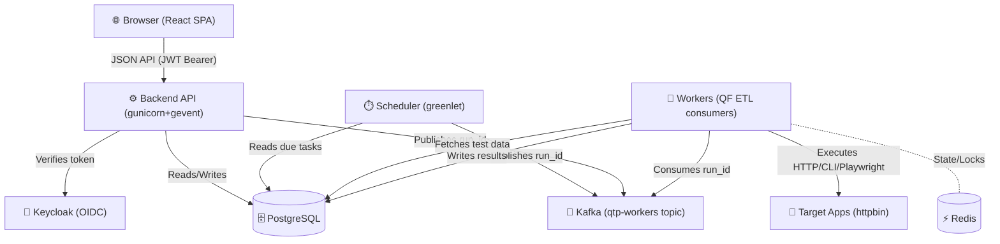

<div align="center">
  <h1>🎯 QSINT Testing Platform (QTP)</h1>
  <p><b>An automation testing control plane + framework for running, scheduling, observing, and analyzing automated tests against any target application.</b></p>
  
  
  
  
  
  
</div>

<br/>

QTP combines two concepts that usually live in two separate tools:

1. **Testkube-style execution** — a control plane that owns test definitions, schedules, a durable PostgreSQL run queue, and horizontal workers that execute tests.
2. **ReportPortal-style reporting** — a centralized store of every run with history, dashboards, failure grouping (signatures), and defect-type triage.

---

## 📖 Table of Contents

- [🎯 Scope & Vision](#-scope--vision)
- [💡 Use Cases](#-use-cases)
- [✨ Key Features](#-key-features)
- [🚀 Quick Start (Docker)](#-quick-start-docker)
- [🏗 Architecture](#-architecture)
- [🛠 Developer Tutorials](#-developer-tutorials)
- [🔌 Ports & Services](#-ports--services)
- [💻 Local Development (without Docker)](#-local-development-without-docker)

---

## 🎯 Scope & Vision

QTP is built for developers and QA engineers who need a unified, scalable platform to author, orchestrate, and observe tests across different environments. Instead of fighting with scattered CI pipelines for scheduled jobs and static HTML reports, QTP provides a single pane of glass for all your test scenarios—from simple HTTP checks to complex UI workflows.

Tests are authored in two primary ways:
1. **Code-based scenarios** written in Python in a fluent, imperative style.
2. **UI Request Builder** acting as a Postman-like interface to assert on response bodies, headers, and timings.

## 💡 Use Cases

- **Synthetic Monitoring**: Schedule tests to run every 5 minutes against production to ensure critical user journeys are healthy.
- **API Contract Testing**: Assert on precise JSON payloads and HTTP statuses to ensure backend services meet their contracts.
- **End-to-End (E2E) Workflows**: Chain multi-step requests, capturing data from one response and injecting it into the next.
- **Defect Triage**: When a test fails, triage it directly in the UI as a `product_bug`, `automation_bug`, or `system_issue` to measure test reliability vs actual application health.

---

## ✨ Key Features

- 📚 **Test Catalog** — Auto-discovered code tests + saved UI tests. Run any on demand.
- 🛠️ **Request Builder** — Postman-like experience. Send unsaved requests, assert on the body, save as a managed test.
- 📊 **Runs & Analytics** — Live status, per-assertion results, response payloads, logs, failure classification, and defect-type triage.
- ⏱️ **Schedules** — Interval, cron, or one-off recurrence.
- 📈 **Overview Dashboard** — KPIs, run execution trends, defect distributions, and per-target health breakdown.
- ⚡ **Scalable Workers** — Capability-aware execution workers scaling independently.

---

## 🚀 Quick Start (Docker)

To build and start the entire stack locally:

```bash
docker compose up -d --build
```

This launches PostgreSQL 17, Kafka + Kafka UI, Redis, Jaeger, Keycloak 26.1 (with auto-imported realm), a demo target (`httpbin`), the QTP backend API, 3 execution workers, and the frontend SPA. The `init` service automatically seeds the database with demo targets, scenarios, schedules, and runs.

### 🌐 Accessing the Platform

| Service | URL | Credentials |
| --- | --- | --- |
| **Web UI** | [http://localhost:5173](http://localhost:5173) | `admin` / `admin` |
| **Backend API** | [http://localhost:5100/qtp](http://localhost:5100/qtp) | Bearer token (Keycloak) |
| **Keycloak Admin** | [http://localhost:8080](http://localhost:8080) | `admin` / `admin` |
| **Kafka UI** | [http://localhost:8081](http://localhost:8081) | — |
| **Jaeger UI** | [http://localhost:16686](http://localhost:16686) | — |
| **Demo Target (httpbin)**| [http://localhost:8088](http://localhost:8088) | — |

> **Note:** The only pre-configured application user is `admin` / `admin` (Keycloak realm `qtp`, role `qtp_admin`). Be sure to change these credentials before any non-local use.

### 🔑 Getting an API Token

For curl/CI integration, you can use the hardcoded system token (which bypasses IAM checks and resolves to the `admin` user):

```bash
curl -s http://localhost:5100/qtp/api/tests \
  -H "Authorization: Bearer system-bearer-token"
```

Or authenticate properly via Keycloak:
```bash
TOKEN=$(curl -s http://localhost:8080/realms/qtp/protocol/openid-connect/token \
  -d grant_type=password -d client_id=qtp-spa \
  -d username=admin -d password=admin | python3 -c "import sys,json;print(json.load(sys.stdin)['access_token'])")

curl -s http://localhost:5100/qtp/api/tests -H "Authorization: Bearer $TOKEN"
```

---

## 🏗 Architecture

QTP is a **modulith with two entrypoints**: a **backend** (API + scheduler) and a **worker**, both scaling independently. Runs are dispatched to workers over **Kafka**.



The backend **produces** run ids to Kafka; each run id lands on one partition, ensuring exactly one worker in the group executes it.

### ⚖️ Scaling
```bash
# Default: backend×1, worker×3
docker compose up -d --build

# Scale workers horizontally to process more parallel tests
docker compose up -d --scale worker=6
```

---

## 🛠 Developer Tutorials

### 1. Adding a Python Code Scenario

To author a code-based test, add a single file to `backend/scenarios/automation/<target>/<name>.py`. 
Subclass `HttpTest`, declare `TestMetadata`, and write your scenario in the `test(self, ctx)` method using our fluent assertion framework.

```python
# backend/scenarios/automation/qtp_self/self_health.py
from src.testkit import HttpTest, TestMetadata, TYPE_HTTP

class SelfHealth(HttpTest):
    metadata = TestMetadata(
        key="self.health", 
        name="QTP · health returns ok",
        type=TYPE_HTTP, 
        tags=["self", "health"], 
        owner="admin",
        target="qtp_self"
    )

    def test(self, ctx):
        # Multi-step flows can group actions with ctx.step()
        with ctx.step("Check readiness endpoint"):
            response = ctx.http.get("/readiness")
            response.should.have_status(200)
            response.should.respond_within_ms(3000)
            response.json.should.have_field("status").equal_to("ok")
```
**No registration is needed.** The platform automatically discovers new test files mapped to your target directories!

### 2. Creating a Request Builder Test (No-Code)

1. Open the **Request Builder** tab in the UI.
2. Select your HTTP Method, enter an Endpoint (e.g., `{{target_url}}/api/users`).
3. Define Headers, Query Params, or Body (JSON, Text, Form, GraphQL).
4. Click **Send** to dry-run the request and view the response.
5. In the Assertions tab, define rules like `status_code == 200` or `body.json().data.id is_not_null`.
6. Click **Save as Test** to persist it in the Test Catalog for future manual or scheduled runs.

---

## 🔌 Ports & Services

| Port | Service | Purpose |
| --- | --- | --- |
| `5173` | Frontend (Nginx) | QTP Web Interface |
| `5100` | Backend API | Core JSON REST API |
| `8080` | Keycloak | IAM & OIDC Authentication |
| `8081` | Kafka UI | Manage Kafka topics, consumers, messages |
| `8088` | Demo Target | `httpbin` echo server for local testing |
| `9094` | Kafka | Internal host/external listener |
| `6379` | Redis | Distributed locks & ETL runtime state |
| `16686`| Jaeger UI | Distributed tracing viewer |
| `4317` | OTLP gRPC | OpenTelemetry receiver for traces |
| `5432` | PostgreSQL | Run-state source of truth |

---

## 💻 Local Development (without Docker)

If you prefer to run services bare-metal:

**1. Start Backend & Scheduler**
```bash
cd backend
python3 -m venv .venv 
./.venv/bin/pip install dist/qf-1.0.2-py3-none-any.whl -r requirements.txt

# Ensure databases/kafka are reachable via .env vars, then init DB:
./.venv/bin/python scripts/init_db.py                             

# Run Backend (API + Scheduler)
./.venv/bin/gunicorn -c gunicorn.conf.py wsgi:app                 
```

**2. Start Worker(s)**
```bash
cd worker
# The worker imports from backend/src
PYTHONPATH=../backend ../backend/.venv/bin/gunicorn -c gunicorn.conf.py wsgi:app
```

**3. Start Frontend**
```bash
cd frontend
npm install && npm run dev
# App will run at http://localhost:5173
```
